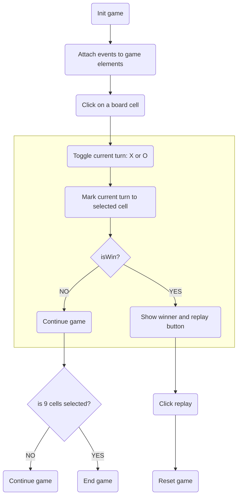

# Tic tac toe game 

A simple tic tac toe game using vanilla javascript.
This repo is used for teaching purpose.

Demo: https://paulnguyen-mn.github.io/js-tic-tac-toe/

## Game elements

| Element             | Available class    | Desc                  |
| ------------------- | ------------------ | --------------------- |
| `span`#currentTurn  | cross, circle      | Show current turn     |
| `button`#replayGame | show, hide         | Show/Hide replay game |
| `ul`#cellList > li  | cross, circle, win | Cell element          |

## Game flow

Happy coding! ❤️
