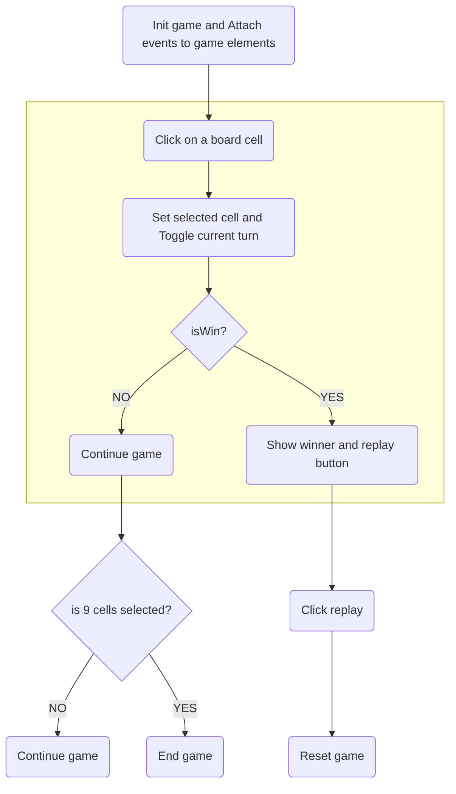

# Tic tac toe game 

A simple tic tac toe game using vanilla javascript.
This repo is used for teaching purpose.

Demo: [https://paultictactoe.surge.sh/](https://paultictactoe.surge.sh/)

## Game elements

| Element             | Available class    | Desc                                    |
| ------------------- | ------------------ | --------------------------------------- |
| `span`#currentTurn  | cross, circle      | Show current turn                       |
| `span`#gameStatus   |                    | Game status                             |
| `button`#replayGame | show               | Show/Hide replay game (hide by default) |
| `ul`#cellList > li  | cross, circle, win | Cell element                            |

## Folder structure

```sh
js-tic-tac-toe
|__ css
|__ images
|__ js
|  |__ main.js      # entry point
|  |__ constants.js # where all constants are defined
|  |__ selectors.js # selectors to get all DOM elements needed
|  |__ utils.js     # having shared functions to reuse
|
|__ index.html
```

<div style="page-break-after: always;"></div>

## Game flow



Happy Coding! 💪
